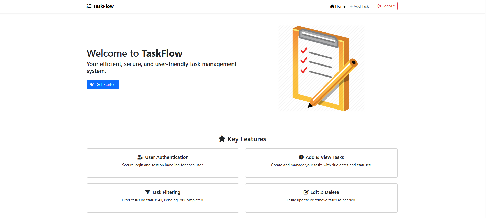
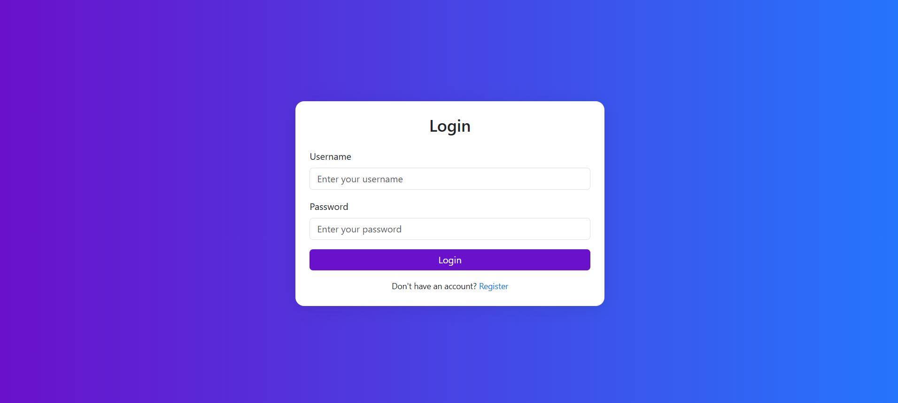
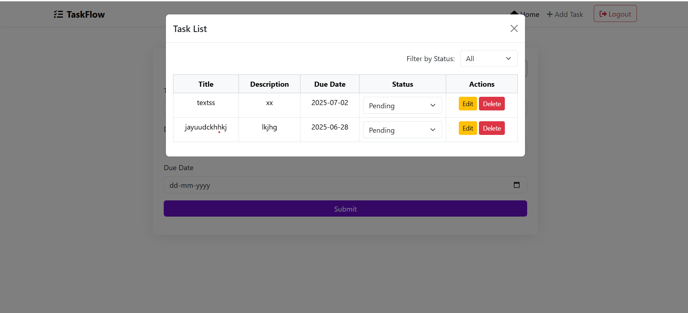
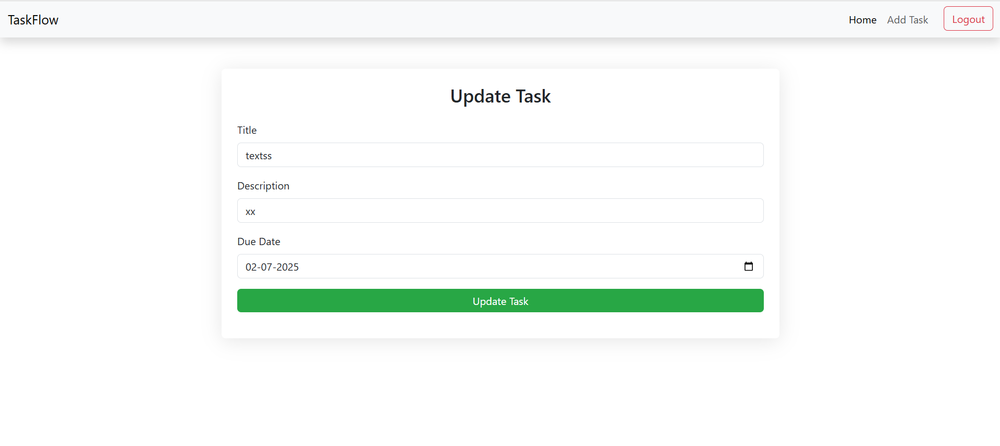

# 🗂️ TaskFlow - Java Web-Based Task Manager

TaskFlow is a lightweight web-based task management system built using Java Servlets, JSP, MySQL, and Bootstrap. It allows users to log in, create tasks, view, filter by status, and manage their to-dos efficiently.

---

## 🚀 Features

- ✅ User Login & Session Management  
- 📝 Add, View, and Manage Tasks  
- 🔄 Toggle Task Status (Pending ↔ Completed)  
- 🔍 Task Filtering by Status  
- 🎨 Responsive UI using Bootstrap  
- 📦 MySQL Database Integration  

---

## 🧰 Tech Stack

- **Frontend:** HTML, JSP, JavaScript, Bootstrap  
- **Backend:** Java Servlet, JSP  
- **Database:** MySQL  
- **Server:** Apache Tomcat  
- **IDE:** Eclipse / IntelliJ  

---

## 📸 Screenshots
### 🏠 Home / Dashboard

### 🔐 Register Page

### 🔐 login Page

### ➕ Add Task

### 📋 View Tasks

### 🔍 Update Tasks

---

## 🛠️ Setup Instructions

### 🔧 1. Environment Setup

- Install **XAMPP** / **WAMP** (or any MySQL server).
- Install **Apache Tomcat**.
- Use **Eclipse** or **IntelliJ** with Java EE support.
- Add **MySQL JDBC Connector** `.jar` file to `/lib`.

